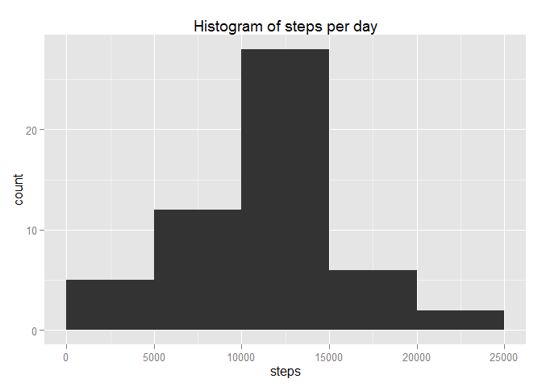
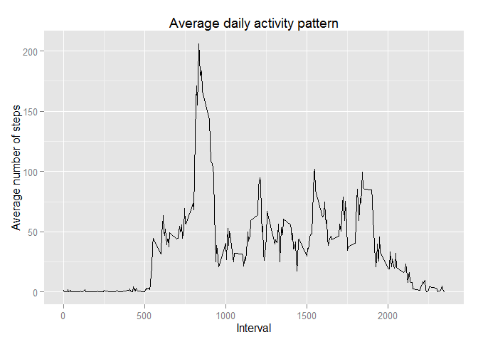
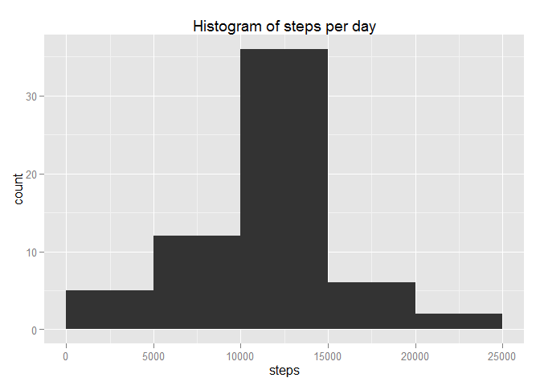
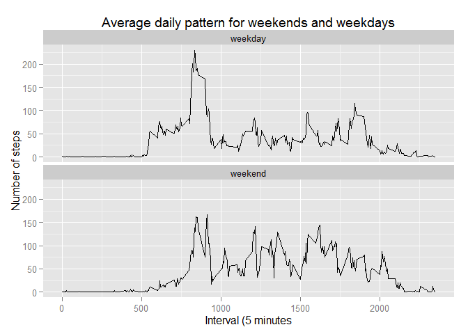

# Reproducible Research: Peer Assessment 1
This is a report answering the questions of Assignment 1 of the course "Reproducible Research". It includes the necessary code to process the data and generate all shown outputs and a desciption of each step.


## Loading and preprocessing the data
Load data from csv file, which must be located in the working directory.

```r
file.name <- "activity.csv"
data <- read.csv(file.name, stringsAsFactors = F)
```

Investigate data file

```r
head(data)
```

```
##   steps       date interval
## 1    NA 2012-10-01        0
## 2    NA 2012-10-01        5
## 3    NA 2012-10-01       10
## 4    NA 2012-10-01       15
## 5    NA 2012-10-01       20
## 6    NA 2012-10-01       25
```

```r
lapply(data, class) #check class of data
```

```
## $steps
## [1] "integer"
## 
## $date
## [1] "character"
## 
## $interval
## [1] "integer"
```

```r
summary(data)
```

```
##      steps            date              interval     
##  Min.   :  0.00   Length:17568       Min.   :   0.0  
##  1st Qu.:  0.00   Class :character   1st Qu.: 588.8  
##  Median :  0.00   Mode  :character   Median :1177.5  
##  Mean   : 37.38                      Mean   :1177.5  
##  3rd Qu.: 12.00                      3rd Qu.:1766.2  
##  Max.   :806.00                      Max.   :2355.0  
##  NA's   :2304
```

```r
sum(is.na(data$steps)) #check number of NAs
```

```
## [1] 2304
```

Transform date stored as character into date format

```r
data$date <- as.Date(data$date, "%Y-%m-%d")
head(data)
```

```
##   steps       date interval
## 1    NA 2012-10-01        0
## 2    NA 2012-10-01        5
## 3    NA 2012-10-01       10
## 4    NA 2012-10-01       15
## 5    NA 2012-10-01       20
## 6    NA 2012-10-01       25
```

```r
lapply(data, class) #check class of data
```

```
## $steps
## [1] "integer"
## 
## $date
## [1] "Date"
## 
## $interval
## [1] "integer"
```

## What is mean total number of steps taken per day?
Create data frame with sum of steps per day.
Alternative 1 uses tapply based on date as factor:

```r
date <- levels(as.factor(data$date)) #creates date vector
steps <- tapply(data$steps, as.factor(data$date), sum, na.rm = F) #creates vector with number of steps per day
data.perday1 <- data.frame(date = date, steps = steps)
head(data.perday1)
```

```
##                  date steps
## 2012-10-01 2012-10-01    NA
## 2012-10-02 2012-10-02   126
## 2012-10-03 2012-10-03 11352
## 2012-10-04 2012-10-04 12116
## 2012-10-05 2012-10-05 13294
## 2012-10-06 2012-10-06 15420
```

```r
str(data.perday1)
```

```
## 'data.frame':	61 obs. of  2 variables:
##  $ date : Factor w/ 61 levels "2012-10-01","2012-10-02",..: 1 2 3 4 5 6 7 8 9 10 ...
##  $ steps: int [1:61(1d)] NA 126 11352 12116 13294 15420 11015 NA 12811 9900 ...
##   ..- attr(*, "dimnames")=List of 1
##   .. ..$ : chr  "2012-10-01" "2012-10-02" "2012-10-03" "2012-10-04" ...
```

```r
sum(is.na(data.perday1$steps)) #check number of NAs
```

```
## [1] 8
```

Alternative 2 uses xtabs:

```r
data.perday2 <- with(data, xtabs(steps ~ date))
data.perday2 <- as.data.frame(data.perday2)
head(data.perday2)
```

```
##         date  Freq
## 1 2012-10-02   126
## 2 2012-10-03 11352
## 3 2012-10-04 12116
## 4 2012-10-05 13294
## 5 2012-10-06 15420
## 6 2012-10-07 11015
```

```r
str(data.perday2)
```

```
## 'data.frame':	53 obs. of  2 variables:
##  $ date: Factor w/ 53 levels "2012-10-02","2012-10-03",..: 1 2 3 4 5 6 7 8 9 10 ...
##  $ Freq: num  126 11352 12116 13294 15420 ...
```

```r
sum(is.na(data.perday2)) #check number of NAs. Should be 0 since 8 NAs removed by xtabs
```

```
## [1] 0
```

Create histogram of steps per day using ggplot2 package

```r
data.range <- with(data.perday1, max(steps, na.rm = T) - min(steps, na.rm = T))
data.range #calculate data range to determine useful breaks
```

```
## [1] 21153
```

```r
data.range/4 #determine approximate bindwidth by dividing range by 4
```

```
## [1] 5288.25
```

```r
library(ggplot2) #Load ggplot2 package. ggplot2 must be installed
```

```
## Warning: package 'ggplot2' was built under R version 3.1.3
```

```r
plot1 <- ggplot(data.perday1, aes(steps))
print1 <- plot1 + geom_histogram(breaks = seq(0, 25000, 5000)) +
    labs(title = "Histogram of steps per day") #histogram with breaks every 5000, ,range is from 0 to 25000
print1
```

 
    
The total number of steps is 570608.

Calculate and report the mean and median of the total number of steps taken per day

```r
mean.per.day <- mean(data.perday1[, 2], na.rm = T) 
median.per.day <- median(data.perday1[, 2], na.rm = T)
```

The mean of the total number of steps taken per day is 10766.19.  
The median of the total number of steps taken per day is 10765.

## What is the average daily activity pattern?
Calculate daily pattern

```r
library(dplyr) #load dplyr package which must be installed already
```

```
## Warning: package 'dplyr' was built under R version 3.1.3
```

```
## 
## Attaching package: 'dplyr'
## 
## The following object is masked from 'package:stats':
## 
##     filter
## 
## The following objects are masked from 'package:base':
## 
##     intersect, setdiff, setequal, union
```

```r
data.grouped <- group_by(data, interval) #group data by interval
daily.pattern <- summarise(data.grouped, mean(steps, na.rm = T))
head(daily.pattern)
```

```
## Source: local data frame [6 x 2]
## 
##   interval mean(steps, na.rm = T)
## 1        0              1.7169811
## 2        5              0.3396226
## 3       10              0.1320755
## 4       15              0.1509434
## 5       20              0.0754717
## 6       25              2.0943396
```

```r
names(daily.pattern)[2] <- "meanSteps"
```

Create time series plot of the 5-minute interval (x-axis) and the average number of steps taken, averaged across all days (y-axis)

```r
plot2 <- ggplot(daily.pattern, aes(interval, meanSteps))
print2 <- plot2 + geom_line() + 
    labs(title = "Average daily activity pattern", x = "Interval",
         y = "Average number of steps")
print2
```

 

Determine 5-minute interval which, on average across all the days in the dataset, contains the maximum number of steps  

```r
daily.peak <- daily.pattern[with(daily.pattern, (which.max(meanSteps))), 1]
daily.peak
```

```
## Source: local data frame [1 x 1]
## 
##   interval
## 1      835
```

The interval with the maximum number of steps is 835.

## Imputing missing values
Calculate and report the total number of missing values in the dataset (i.e. the total number of rows with NAs)

```r
NAs <- sum(is.na(data$steps)) #number of NAs
```
The number of NAs is 2304.  
  
Fill in NAs using the mean for that 5-minute invterval across all days

```r
daily.pattern.rep <- unlist((rep(daily.pattern[, 2], times = 61))) #prepare vector with daily pattern 61 times to match length of data frame 
NA.vector <- which(is.na(data$steps)) #create vector with index of NA values
data.imp.NA <- data #prepare new data frame to impute NA values
data.imp.NA[NA.vector, 1] <- daily.pattern.rep[NA.vector] #replace NA values using mean for 5-minute interval across all days ("daily.pattern")
head(data.imp.NA)
```

```
##       steps       date interval
## 1 1.7169811 2012-10-01        0
## 2 0.3396226 2012-10-01        5
## 3 0.1320755 2012-10-01       10
## 4 0.1509434 2012-10-01       15
## 5 0.0754717 2012-10-01       20
## 6 2.0943396 2012-10-01       25
```

```r
sum(is.na(data.imp.NA$steps)) #check for NAs
```

```
## [1] 0
```

Prepare data for histogram of the total number of steps taken each day

```r
date <- levels(as.factor(data.imp.NA$date)) #creates date vector
steps <- tapply(data.imp.NA$steps, as.factor(data.imp.NA$date), sum, na.rm = F) #creates vector with number of steps per day
data.perday.imp.NA <- data.frame(date = date, steps = steps)
head(data.perday.imp.NA)
```

```
##                  date    steps
## 2012-10-01 2012-10-01 10766.19
## 2012-10-02 2012-10-02   126.00
## 2012-10-03 2012-10-03 11352.00
## 2012-10-04 2012-10-04 12116.00
## 2012-10-05 2012-10-05 13294.00
## 2012-10-06 2012-10-06 15420.00
```

Create histogram of steps per day using ggplot2 package

```r
data.range <- with(data.perday.imp.NA, max(steps, na.rm = T) - min(steps, na.rm = T))
data.range #calculate data range to determine useful breaks
```

```
## [1] 21153
```

```r
data.range/4 #approximate bindwidth
```

```
## [1] 5288.25
```

```r
library(ggplot2) #Load ggplot2 package. ggplot2 must be installed.
plot1 <- ggplot(data.perday.imp.NA, aes(steps))
print1 <- plot1 + geom_histogram(breaks = seq(0, 25000, 5000)) +
    labs(title = "Histogram of steps per day")
print1
```

 
  
The total number of steps after imputing NA values is 656737.5 (old values is 570608). 

Calculate and report the mean and median of the total number of steps taken per day.

```r
mean.per.day.imp.NA <- mean(data.perday.imp.NA[, 2], na.rm = T) 
median.per.day.imp.NA <- median(data.perday.imp.NA[, 2], na.rm = T)
```

The new mean of the total number of steps taken per day after imputing NA values is 10766.19 (old values is 10766.19)  
The new median of the total number of steps taken per day after imputing NA values is 10766.19 (old value is 10765).  
The mean remains unchanged because NA values were imputed using the mean for the 5-minute interval across all days.

## Are there differences in activity patterns between weekdays and weekends?
Create a new factor variable in the dataset with two levels - "weekday" and "weekend" indicating whether a given date is a weekday or weekend day.

```r
logical.vector <- weekdays(data$date) == "Saturday" | weekdays(data$date) == "Sunday" #logical vector, TRUE if Saturday or Sunday
day.type <- vector(mode = "character") #create character vector
day.type[logical.vector] <- "weekend" 
day.type[!logical.vector] <- "weekday"
day.type <- as.factor(day.type) #convert to factor
data.imp.NA <- cbind(data.imp.NA, day.type) #bind factor vector to new data frame
head(data.imp.NA)
```

```
##       steps       date interval day.type
## 1 1.7169811 2012-10-01        0  weekday
## 2 0.3396226 2012-10-01        5  weekday
## 3 0.1320755 2012-10-01       10  weekday
## 4 0.1509434 2012-10-01       15  weekday
## 5 0.0754717 2012-10-01       20  weekday
## 6 2.0943396 2012-10-01       25  weekday
```
 
Create time series plot of the 5-minute interval (x-axis) and the average number of steps taken, averaged across all weekdays and weekend, respectively (y-axis)

```r
daily.pattern.week <- summarise(group_by(data.imp.NA, interval, day.type), mean(steps))
head(daily.pattern.week)
```

```
## Source: local data frame [6 x 3]
## Groups: interval
## 
##   interval day.type mean(steps)
## 1        0  weekday  2.25115304
## 2        0  weekend  0.21462264
## 3        5  weekday  0.44528302
## 4        5  weekend  0.04245283
## 5       10  weekday  0.17316562
## 6       10  weekend  0.01650943
```

```r
names(daily.pattern.week)[3] <- "meanSteps"
plot2 <- ggplot(daily.pattern.week, aes(interval, meanSteps))
print2 <- plot2 + geom_line() + facet_wrap(~day.type, 2) + labs(title = "Average daily pattern for weekends and weekdays", x = "Interval (5 minutes", y = "Number of steps")
print2
```

 
